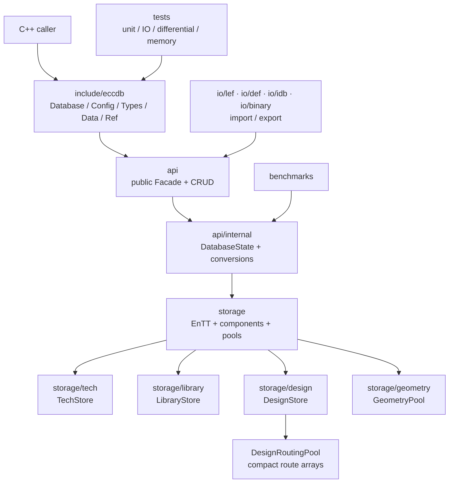
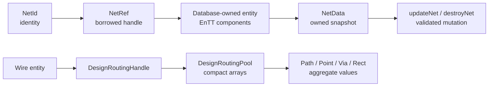
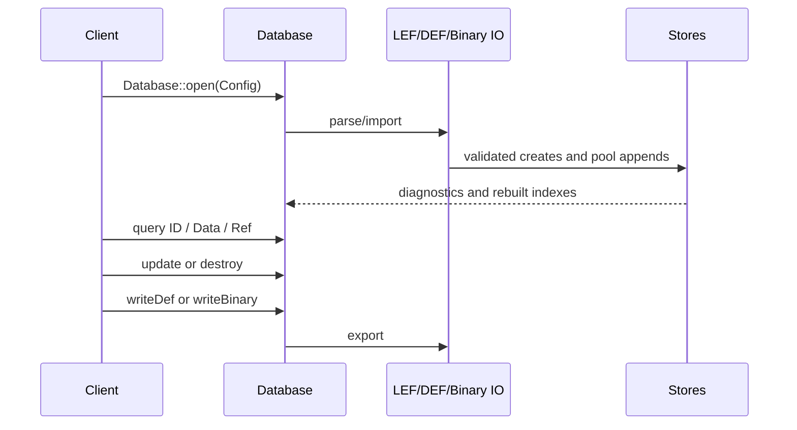

# EccDB Architecture and Object Semantics

Chinese version: [Architecture.zh-CN.md](Architecture.zh-CN.md)

This document describes the implementation that currently exists under `src/database/eccdb`: its layers, ownership rules, and public API semantics. Planned work is called out explicitly instead of being presented as an existing capability.

## 1. Overall layering

The stable EccDB core currently has five practical layers:

1. **Public API**: `Database`, `Config`, strong ID types, Data values, and Ref handles under `include/eccdb`.
2. **API implementation**: `api` and `api/internal`, which implement the Facade, own the PImpl state, and convert public values to internal types.
3. **Storage**: `storage`, containing EnTT registries, components, indexes, `GeometryPool`, and `DesignRoutingPool`.
4. **Format IO**: `io/lef`, `io/def`, `io/idb`, and `io/binary`, which materialize or export database objects.
5. **Validation and performance**: `tests` and `benchmarks`, covering invariants, round trips, semantic differential tests, memory, and performance.

The code relationship is shown below. It uses only the current source directories and responsibilities; external tools and future FFI components are intentionally excluded from the EccDB module graph.



The diagram keeps only the current EccDB boundary. It deliberately does not present an external renderer, router, or DRC tool as an EccDB runtime component. Those tools are outside the stable EccDB API.

## 2. Directory responsibilities

| Directory | Current responsibility | Public interface |
| --- | --- | --- |
| `include/eccdb` | Installed C++ headers for configuration, IDs, Data, and Ref | Yes |
| `api` | `Database` implementation, CRUD delegation, diagnostics, and output | No; linked by `eccdb_api` |
| `api/internal` | `DatabaseState` PImpl and `StorageConversions` | No; not a second public object model |
| `storage/common` | Shared internal `EnttId` and geometry types | No |
| `storage/tech` | Layers, rules, Via masters, NDRs, and technology data | No |
| `storage/library` | Sites, cell masters, master terms, ports, and obstructions | No |
| `storage/design` | Floorplan, netlist, connectivity, routing, constraints, and fills | No |
| `storage/geometry` | `GeometryPool`, polygon rectangularization, and handles | No |
| `io/lef`, `io/def` | SI2 parser sequences, importers, and exporters | No |
| `io/idb` | Legacy iDB LEF conversion adapter | No |
| `io/binary` | Three-domain binary archives, schemas, and payloads | No |
| External tool integration | Outside the stable EccDB architecture; intentionally omitted from this diagram | No |
| `tests` | Unit, IO, differential, adapter, and memory tests | No |
| `benchmarks` | Binary, EccDB, and input-data benchmarks | No |

## 3. The three storage domains

### 3.1 `TechStore`

`TechStore` owns one `TechRegistry` and one `GeometryPool`. Technology layers are not split across independent registries. A base layer ID is combined with routing, cut, implant, masterslice, overlap, or other components to represent its kind; rules and Via definitions are managed by their dedicated storages. Technology geometry lives in the Tech-owned pool, while components keep handles or ranges.

### 3.2 `LibraryStore`

`LibraryStore` owns a Library registry and a library geometry pool. It borrows the `TechRegistry` because macro pins, ports, and obstructions refer to technology layers and Via masters. Consequently, a LibraryStore cannot be moved or destroyed independently of its TechStore.

### 3.3 `DesignStore`

`DesignStore` owns a Design registry and borrows the TechRegistry and LibraryRegistry. It stores design globals, rows, netlist connectivity, routing, constraints, and fills. `DesignEntity` width is selected at compile time by `ECCDB_DESIGN_ENTITY_BITS`, defaulting to 64 bits; it is not a runtime option.

## 4. EnTT, components, and indexes

The storage layer uses EnTT ECS, but EnTT is an implementation mechanism, not the public EccDB object API:

```text
TechRegistry    -> Tech entity + Tech components
LibraryRegistry -> Library entity + Library components
DesignRegistry  -> Design entity + Design components
```

Internal IDs use `EnttId<Entity, Component>` and compile-time component tags. Public headers expose `ObjectId<Tag>` instead, so callers do not depend on EnTT entities or component layouts.

Name maps, reverse connectivity indexes, and ordered lists are derived acceleration data. Binary restore rebuilds them instead of treating them as independent authoritative records. Code that accesses internal Storage directly must follow its index maintenance rules; public CRUD operations centralize the common updates.

## 5. Public API semantics

The public API deliberately separates `ID`, `Data`, and `Ref` semantics instead of returning ECS components directly.

| Type | Examples | Meaning | Ownership |
| --- | --- | --- | --- |
| ID | `NetId`, `WireId`, `ViaId` | Database-local identity token; cheap to copy, compare, store, and hash | Does not own the entity |
| Data | `NetData`, `InstanceData`, `WireRoutingData` | Owned value snapshot; changing it does not mutate the database | Caller owns the copy |
| Ref | `NetRef`, `WireRef`, `InstanceRef` | Non-owning convenience handle containing state pointer and ID | Does not own the database |
| View/span | Internal ranges and `string_view` | Short-lived borrowed access to contiguous storage | Does not own data |

The normal flow is:



### 5.1 IDs

`NetId`, `InstanceId`, `WireId`, and `ViaId` are distinct C++ types and are not implicitly interchangeable. A packed value is meaningful only in the `Database` that created it. It must not be passed to another database or used after the entity is destroyed. EnTT generations detect some stale IDs after destruction and recycling, but there is currently no public database cookie, revision, or ChangeSet API; database ownership remains a caller contract.

### 5.2 Data values

`Database::netData()` and `wireRoutingData()` return `std::optional<Data>` or values containing owned vectors. They are detached snapshots:

```cpp
auto value = database.netData(net);
if (value) {
  value->name = "clk_main";       // changes only the copy
  database.updateNet(net, *value); // explicit writeback
}
```

This will be suitable for future FFI, serialization, and asynchronous work because the result does not depend on an EnTT address. The tradeoff is copying; hot C++ loops should use Ref or internal ranges instead of repeatedly materializing large snapshots.

### 5.3 Refs and borrowed lifetime

`NetRef` and `WireRef` are returned by value, but they are not heap objects and do not own entities. They contain a database-state pointer and an ID. Therefore:

- a Ref must not outlive its `Database`;
- `string_view`, spans, and pool ranges must not cross a mutation that may reallocate or rewrite the underlying storage;
- Refs are C++ convenience tools, not long-lived cross-ABI objects; bindings should prefer IDs and owned Data;
- after moving a `Database`, callers should reacquire Refs instead of relying on an old Ref lifetime.

### 5.4 Mutation and invariants

`createNet`, `updateNet`, `connect`, and `createWire` are controlled write entry points. Storage updates components, name indexes, and reverse connectivity together. `destroyNet` refuses to delete a Net that still has Pin or Wire references. There is no public transaction, undo, revision, or ChangeSet API yet; importer staging/trusted methods and rollback provide exception safety only.

## 6. Wire and geometry storage

A Wire is an entity in the Design registry. Its paths, points, Via placements, and rectangles are aggregate values, not currently independent public entities.

`DesignRoutingPool` stores layer ordinals, path records, points, point extras, vias, Via extras, rectangles, and path extras in contiguous arrays. A `DesignWire` component keeps a routing handle plus Net, status, and shield metadata. A Via placement refers to either a technology `TechViaId` or a design `ViaId`; its definition geometry remains in the corresponding Tech or Design object, while the route stores placement point, orientation, masks, and array information.

Consequently `WireRef::routingData()` materializes an owned `WireRoutingData` value. It is not a second authoritative geometry database. Writeback asks routing storage to update the pool range. Pool spans are invalidated by mutation, and append transactions checkpoint and roll back on failure.

## 7. Input, output, and tool data flow



`Config` currently supports either a set of LEFs plus one DEF, or three independent binary files for technology, library, and design. LEF/DEF parser sequences are protected by mutexes. Importers stage entity and geometry changes and roll them back on failure; this is not a public long-lived transaction.

Binary archives are split by registry domain. Their headers validate magic, format version, schema version, payload size, and exact file size. Derived name indexes are rebuilt after load. Adding a component or pool field requires a corresponding schema version update in `io/binary/BinarySchema.h`.

## 8. External integration boundary

The stable EccDB library owns the database, LEF/DEF/binary IO, and its own tests. Whether external-tool integration exists and how it is built belongs to the larger project configuration; it is not an EccDB built-in capability.

- external clients should use `#include <eccdb/eccdb.h>` and `eccdb::Database`;
- external integration code may use Stores only within its adapter boundary, but Store headers should not leak into the installed API;
- future language bindings or tool plugins should use a restricted DTO/Editor contract for snapshots and geometry writeback;
- sorting and canonicalization belong in differential-test oracles, not production database APIs that would alter input semantics.

## 9. CMake and dependency boundary

The top-level `src/database/eccdb/CMakeLists.txt` owns standalone options, Boost.PFR, the EnTT interface target, subdirectories, and installation exports. Internal storage targets receive C++20, storage/IO include paths, and the vendored EnTT include directory through `eccdb_storage_target`; `eccdb_api` links the internal implementation privately.

The install package contains `include/eccdb/*.h` and the `EccDB::eccdb` target. EnTT include paths are still propagated between internal targets, so complete EnTT hiding is not finished. An ordinary API consumer does not need to include EnTT or any `storage` header.

Use the standalone build described in `BUILDING.md` to generate `compile_commands.json`; do not commit temporary build directories or generated database files to the source tree.

## 10. Current limits and evolution

The implementation now has a usable Facade/PImpl entry point, but it is not a fully sealed database yet:

1. Complete public query/edit APIs for Technology and Library are not implemented; some creation flows still require IDs produced by imported objects.
2. External-tool integration is not unified as a stable DTO/Editor interface and is outside the current EccDB core capability.
3. Invalidation rules for Ref, spans, and `string_view` need further precision in public headers.
4. There is no cross-database cookie, database revision, ChangeSet, transaction, or concurrent read/write protocol.
5. WirePath is currently a Wire aggregate value. Promote it to a `WirePathId` entity only if tools need to cache, delete, or reference paths independently.

The recommended evolution is:

```text
stabilize public API semantics
  -> stop propagating mutable Store/Registry access
  -> add restricted Editor/DTO contracts for tools
  -> complete Tech/Library query APIs
  -> specify view invalidation and threading
  -> then consider revision/ChangeSet/transactions
```

This preserves the compact EnTT and pool representation while giving higher layers IDs, owned Data values, and controlled operations instead of requiring them to assemble components and maintain indexes themselves.
