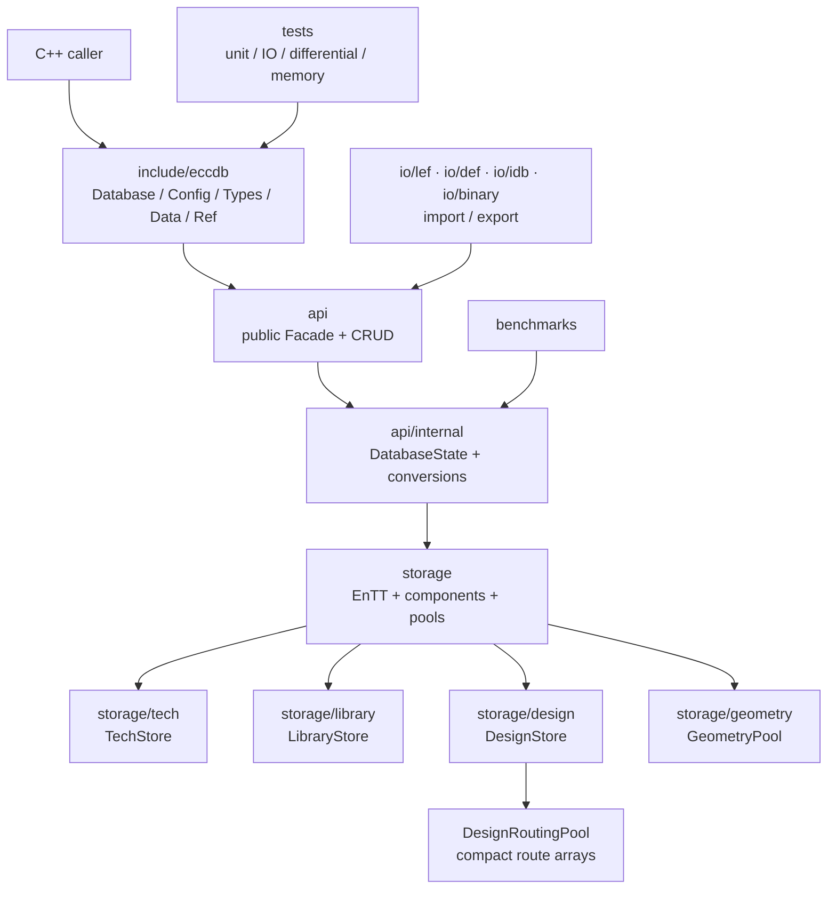
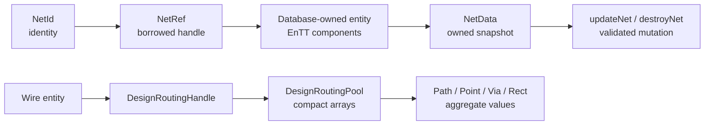
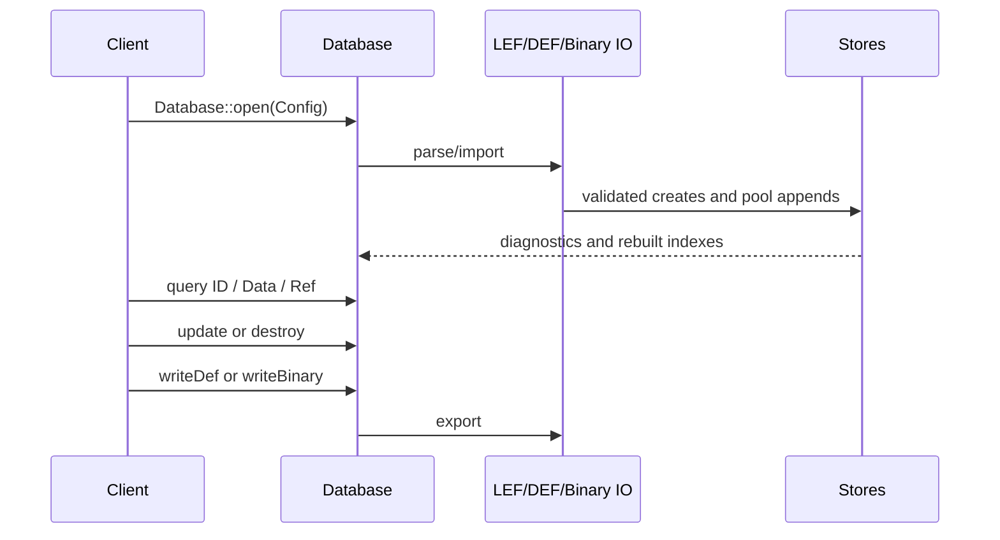

# EccDB 架构与对象语义

English version: [Architecture.en.md](Architecture.en.md)

本文件描述当前 `src/database/eccdb` 的实际分层、数据所有权和公共 API 语义。它是当前实现的架构说明，不把尚未完成的目标设计误写成现有能力。

## 1. 总体分层

稳定的 EccDB 当前可以划分为五层：

1. **公共 API 层**：`include/eccdb` 中的 `Database`、`Config`、强类型 ID、Data 值和 Ref 句柄。
2. **API 实现层**：`api` 和 `api/internal`，负责 Facade、PImpl 状态和公共类型与内部类型的转换。
3. **存储层**：`storage`，包含 EnTT Registry、组件、索引、GeometryPool 和 DesignRoutingPool。
4. **格式 IO 层**：`io/lef`、`io/def`、`io/idb`、`io/binary`，把外部格式物化为存储对象，或从存储对象导出。
5. **验证与性能层**：`tests` 和 `benchmarks`，验证存储不变量、格式往返、差分语义和内存/性能特征。

顶层代码关系如下。图中只使用当前源码目录和类职责，不把外部工具或未来 FFI 组件画成 EccDB 现有模块。



图中只保留当前 EccDB 的真实边界，没有把外部渲染器、布线器或 DRC 工具画成 EccDB 的运行时组件。它们不属于稳定 EccDB API 的一部分。

## 2. 目录与职责

| 目录 | 当前职责 | 是否公共接口 |
| --- | --- | --- |
| `include/eccdb` | 稳定的 C++ 头文件、配置、ID、Data、Ref | 是，安装时只安装这一组头文件 |
| `api` | `Database` 的实现、CRUD 委托、异常/诊断处理 | 否，链接到 `eccdb_api` |
| `api/internal` | `DatabaseState` PImpl 和 `StorageConversions` | 否；不是第二套公共对象模型 |
| `storage/common` | `EnttId`、内部几何类型等共享实现 | 否 |
| `storage/tech` | 技术层、规则、Via master、NDR 等 | 否 |
| `storage/library` | Site、CellMaster、MasterTerm、Port、Obs 等 | 否 |
| `storage/design` | Floorplan、Netlist、Routing、Constraint、Fill 等 | 否 |
| `storage/geometry` | `GeometryPool`、polygon 矩形化和几何句柄 | 否 |
| `io/lef`、`io/def` | SI2 LEF/DEF parser、importer、exporter | 否 |
| `io/idb` | legacy iDB 的 LEF 转换适配 | 否 |
| `io/binary` | 三域 binary archive、schema 和 payload | 否 |
| 外部工具集成 | 不属于稳定 EccDB 主架构；不在本图中展开 | 否 |
| `tests` | 单元、IO、差分、适配器、内存测试 | 否 |
| `benchmarks` | binary、EccDB 和输入数据性能测试 | 否 |

## 3. 三个存储域

### 3.1 `TechStore`

`TechStore` 拥有一个 `TechRegistry` 和一个 `GeometryPool`。技术层不是三套 registry，而是在同一个技术 registry 上通过组件组合表达：基础 layer ID 可以对应 routing、cut、implant、masterslice、overlap 等类型；不同规则和 Via 定义由相应 Storage 管理。技术层几何存储在 Tech 自己的 pool 中，组件只保存 `GeometryHandle` 等范围信息。

### 3.2 `LibraryStore`

`LibraryStore` 拥有 Library registry 和 Library geometry pool，并借用 `TechRegistry`，因为 macro pin、port、obstruction 等几何引用技术层和 Via master。这个借用关系意味着 LibraryStore 不能脱离所属 TechStore 独立移动或销毁。

### 3.3 `DesignStore`

`DesignStore` 拥有 Design registry，并借用 TechRegistry 和 LibraryRegistry。它负责设计全局信息、行、网表、连接关系、布线、约束和 fill。`DesignEntity` 的位宽由编译期宏 `ECCDB_DESIGN_ENTITY_BITS` 决定，默认 64 位；它不是运行时配置。

## 4. EnTT、组件和索引

底层采用 EnTT ECS，但 EnTT 只负责实体生命周期和组件存储，不等于 EccDB 的公共对象 API：

```text
TechRegistry   -> Tech entity + Tech components
LibraryRegistry -> Library entity + Library components
DesignRegistry -> Design entity + Design components
```

每个内部 entity 通过 `EnttId<Entity, Component>` 加上编译期 component tag 形成强类型内部 ID。公共头文件中的 `ObjectId<Tag>` 是数据库本地的轻量身份值，避免把 EnTT registry 或组件类型泄漏给调用方。

名称 map、反向连接索引和顺序列表属于派生加速数据。binary 恢复后会重建这些索引，而不是把它们当成独立权威数据。任何直接使用内部 Storage 的代码都必须遵守其索引维护约定；公共 API 会把常用修改集中委托给 Storage。

## 5. 公共 API 的核心语义

公共 API 采用 `ID + Data + Ref` 三种互补语义，而不是把底层 ECS 组件直接返回给调用方。

| 类型 | 例子 | 语义 | 所有权 |
| --- | --- | --- | --- |
| ID | `NetId`、`WireId`、`ViaId` | 数据库实体的身份 token；可复制、比较、保存、作为 map key | 不拥有实体 |
| Data | `NetData`、`InstanceData`、`WireRoutingData` | 拥有内容的值快照；修改快照不会自动修改数据库 | 调用方拥有副本 |
| Ref | `NetRef`、`WireRef` | `DatabaseState* + ID` 的非 owning 便利句柄 | 不拥有数据库 |
| View/span | 当前内部 range 和 `string_view` | 借用连续存储的短期访问 | 不拥有数据 |

典型流程是：



### 5.1 ID

`NetId`、`InstanceId`、`WireId` 和 `ViaId` 是不同的 C++ 类型，不能隐式互换。ID 的 packed value 只在创建它的 `Database` 中有意义：不能把数据库 A 的 ID 传给数据库 B，也不能在实体删除后继续使用。EnTT 的 generation 可识别一部分“删除后复用”的旧 ID，但当前没有全局 `DatabaseId`、revision 或 ChangeSet API，因此跨数据库归属仍由调用方保证。

### 5.2 Data

`Database::netData()`、`wireRoutingData()` 等返回 `std::optional<Data>` 或拥有 vector 的值。它们是 detached snapshot：

```cpp
auto value = database.netData(net);
if (value) {
  value->name = "clk_main";       // 只改副本
  database.updateNet(net, *value); // 显式写回
}
```

这使未来的 FFI、序列化和异步任务可以拿到不依赖 EnTT 地址的拥有数据。代价是复制；高频 C++ 路径应使用 Ref 或内部 range，而不是在循环中反复物化大型 snapshot。

### 5.3 Ref 和借用生命周期

`NetRef`、`WireRef` 等按值返回，但它们不是堆对象，也不拥有实体。它们内部保存数据库状态指针和 ID，因此：

- Ref 不能比所属 `Database` 活得更久；
- `string_view`、span 和由 pool 返回的 range 不能跨越可能改变底层存储的 mutation；
- Ref 适合 C++ 便利操作，不应直接作为跨 ABI 的长期对象；跨语言绑定应优先传递 ID 和拥有的 Data；
- `Database` 移动后，当前设计仍要求调用方不要依赖 Ref 的旧生命周期，优先重新取得 Ref。

### 5.4 修改和不变量

`createNet`、`updateNet`、`connect`、`createWire` 等 API 是受控写入口，Storage 负责同时维护组件、名称索引和反向连接关系。`destroyNet` 在仍有 Pin 或 Wire 引用时会拒绝删除。当前公共 API 还没有公开的 transaction、undo、revision 或 ChangeSet；导入器内部的 staged/trusted 与 rollback 只是异常安全机制。

## 6. Wire 与几何存储语义

Wire 是 Design registry 中的实体，但 Path、Point、Via placement 和 rectangle 是 Wire 的聚合值，不是目前独立的公共实体 ID。

`DesignRoutingPool` 使用连续数组保存：layer ordinal、path record、point、point extra、via、via extra、rectangle 和 path extra。`DesignWire` 组件只保存 routing handle、所属 Net、状态和 shield 等元数据。一个路径中的 Via placement 通过 `TechViaId` 或 design `ViaId` 的 variant 引用 Via 定义；Via 的定义几何在 TechStore 或 DesignStore 的相应对象中，路径只保存放置点、方向、mask 和阵列信息。

因此 `WireRef::routingData()` 返回的是组装后的 `WireRoutingData` 值副本，不是第二份权威几何数据库。写回时由 routing storage 重新分配/更新 pool 范围。pool 的 span 会在 mutation 后失效，append transaction 用于失败回滚。

## 7. 输入、输出和工具数据流



`Config` 目前支持两类输入：一组 LEF 加一个 DEF，或三份独立 binary（technology、library、design）。LEF/DEF parser 的调用序列由 mutex 保护。导入失败时 importer 会回滚已创建实体和 geometry pool 的 staged 内容；这不是对外承诺的长期事务。

binary 文件按三个 registry 域独立保存，header 会校验 magic、格式版本、schema 版本、payload 大小和文件大小。名称索引等派生数据在载入后重建。新增组件或 pool 字段必须同步更新 `io/binary/BinarySchema.h` 的 schema 版本。

## 8. 外部集成边界

稳定 EccDB 主库只负责数据库、LEF/DEF/binary IO 和自身测试。外部工具集成是否存在、如何构建，由更大的工程配置决定，不应被理解为 EccDB 内置能力。

- EccDB 外部调用方应该使用 `#include <eccdb/eccdb.h>` 和 `eccdb::Database`；
- 外部集成代码只能在适配边界内使用 Store，不应把 Store 头文件传播到安装 API；
- 未来若需要跨语言绑定或工具插件，应增加受限的 DTO/Editor contract，把读取快照和几何写回转换成稳定数据；
- 测试中的排序和 canonicalization 只属于 oracle/differential 层，不应放进生产数据库 API 来改变输入语义。

## 9. CMake 与依赖边界

顶层 `src/database/eccdb/CMakeLists.txt` 负责 standalone 选项、Boost.PFR、EnTT interface target、各子目录和安装导出。内部 storage target 通过 `eccdb_storage_target` 获得 C++20、storage/io include 路径及第三方 EnTT；公共 `eccdb_api` 以私有实现依赖链接这些 target。

安装包只安装 `include/eccdb/*.h` 和 `EccDB::eccdb` target。当前实现仍在内部 target 之间传播 EnTT include path，因此“完全隐藏 EnTT”还没有完成；但普通 API 使用者不需要包含 EnTT 或任何 `storage` 头。

建议使用 `BUILDING.md` 中的 standalone build 生成 `compile_commands.json`，不要把临时 build 目录或生成的数据库文件提交到源码树。

## 10. 当前限制与演进顺序

当前实现已经具备可用的 Facade/PImpl 入口，但还不是完全封装的数据库：

1. Technology、Library 的完整公共查询/编辑 API 尚未补齐，部分创建流程仍需要导入对象产生的 ID。
2. 外部工具集成尚未统一为稳定 DTO/Editor 接口，不属于当前 EccDB 核心能力。
3. `Ref`、span 和 `string_view` 的失效规则需要在公共头文件中进一步细化。
4. 没有跨数据库 cookie、数据库 revision、ChangeSet、transaction 或并发读写协议。
5. WirePath 目前是 Wire 聚合值；只有当工具需要独立缓存、删除或引用 Path 时，才应把它升级为 `WirePathId` 实体。

推荐的演进顺序是：

```text
公共 API 语义稳定
  -> 收紧可变 Store/Registry 的传播
  -> 为工具增加受限 Editor/DTO contract
  -> 补齐 Tech/Library 查询 API
  -> 明确 view invalidation 和线程协议
  -> 再考虑 revision/ChangeSet/transaction
```

这条顺序保留了 EnTT 和连续 Pool 的紧凑存储优势，同时让上层以 ID、拥有 Data 和受控操作使用数据库，而不是自行拼装组件和维护索引。
